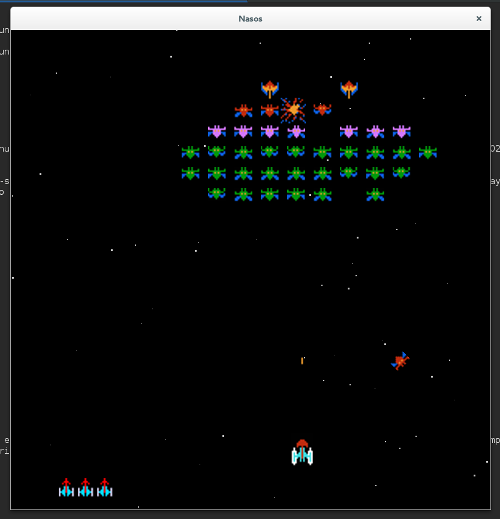

# Nasos

Nasos is an open source clone of [Galaxian][galaxian]. My goal was to do some
project using [SDL2][sdl2], and have some fun writing some code.




# Installing and running

First you need to install some requirements:

```
# Fedora, Redhat, CentOS
sudo yum install autoconf automake libtool
sudo yum install SDL2-devel SDL2_gfx-devel SDL2_mixer-devel SDL2_ttf-devel

# Ubuntu
sudo apt install autoconf automake libtool
sudo apt install libsdl2-dev libsdl2-gfx-dev libsdl2-mixer-dev libsdl2-ttf-dev
```

Now, you can compile the game:

```
./autogen.sh
./configure
make
sudo make install
```

To run the game:

```
nasos
```


# License

The code for this project is licensed under GNU GPL 2. You can see a copy of
this license [here](LICENSE).

All of the sound effects are downloaded from [freesound.org][freesound].

All of the fonts are download from [openfontlibrary.org][openfontlibrary].

The sprites are downloaded from [spriters-resource.com][sprites].


[galaxian]: http://en.wikipedia.org/wiki/Galaxian
[sdl2]: https://www.libsdl.org/
[freesound]: http://freesound.org
[openfontlibrary]: http://openfontlibrary.org/
[sprites]: http://www.spriters-resource.com/download/22731/
